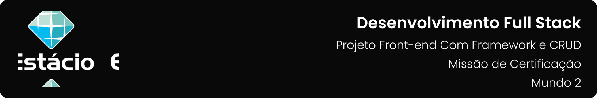

---

[Projeto](#-projeto) • [Como baixar e executar](#-como-baixar-e-executar) • [Funcionalidades](#-funcionalidades) • [Tecnologias utilizadas](#-tecnologias-utilizadas) • [Autor](#-autor) • [Licença](#-licença)

---

## 📋 Projeto
Projeto de aplicação front-end de lista de tarefas com CRUD, desenvolvida com HTML, CSS, Bootstrap e JavaScript, apresentada como parte da **`Misssão Certificação: Projeto Front-end Com Framework e CRUD`** do **`Mundo 2`** do curso de **`Desenvolvimento Full Stack`** da **`Estácio`**, do semestre de **`2023.2`**, sob a tutoria de André Luiz Avelino Sobral e orientações do Mestre dos Magos da missão, Aldo Rocha.

Projeto elaborado de acordo com as diretrizes especificadas para a Missão Certificação, que podem ser conferidas [**`clicando aqui`**](https://sway.office.com/JRfmRetNTlZi3uLD?ref=Link&loc=play).

## 📥 Como baixar e executar

Para baixar os arquivos deste repositório, você deve ter o [GitHub](https://github.com/) instalado em seu dispositivo.

Após instalado, você deverá acessar a guia `Arquivo` → `Clonar repositório` → `URL` e incluir o caminho `guedesert/projeto-front-end-com-framework-e-crud`.

Além disso, é interessante que você tenha um bom editor para trabalhar com os códigos, dos quais eu recomendo o uso do, [Visual Studio Code](https://code.visualstudio.com/). Como também, um navegador de internet, tendo sido o [Microsoft Edge](https://www.microsoft.com/pt-br/edge?form=MA13FJ) o mais utilizado durante o desenvolvimento da aplicação.

## 🗃 Funcionalidades
- Interação com o usuário para definir ou alterar o nome de usuário.
- Manipulação do armazenamento local (localStorage) para armazenar tarefas e nome de usuário.
- Reorganização de tarefas usando arrastar e soltar para reordenar as tarefas ou movimentá-las entre as listas.
- Manipulação de dados, permitindo concluir ou reabrir tarefas, além de criar editar e excluir.

## 🛠 Tecnologias utilizadas

Para a construção e execução do projeto foram utilizadas as seguintes tecnologias:

     

## 👥 Autor

| Aluno                                                  | Matrícula    | E-mail                                          |
| ------------------------------------------------------ | ------------ | ----------------------------------------------- |
| [Emanuel Roseira Guedes](https://github.com/guedesert) | 202212181407 | [📧](mailto:202212181407@alunos.estacio.br) |

## 📃 Licença

Este repositório está licensiado sob a [Licença MIT](./LICENSE).

